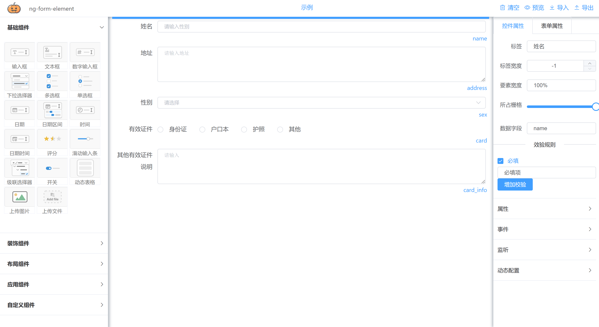
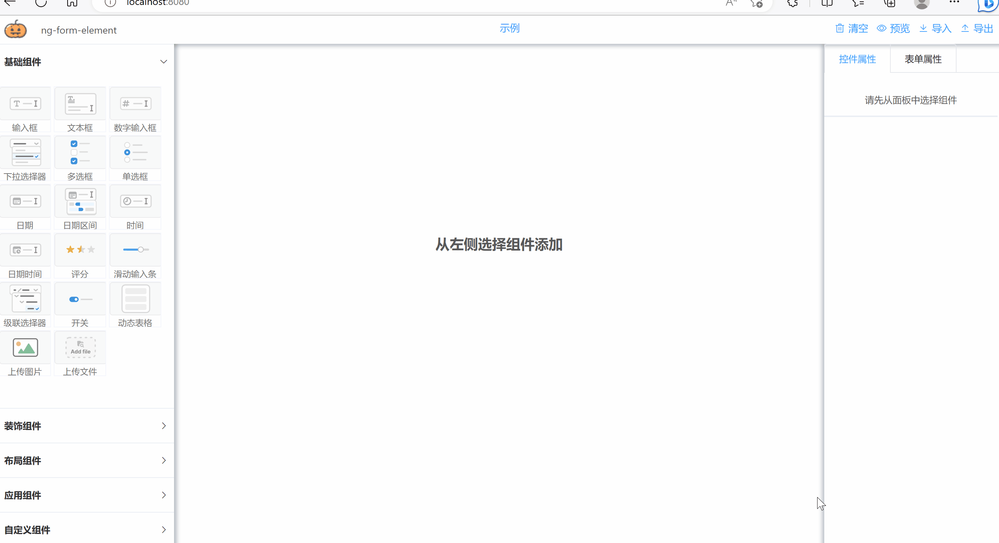

# ng-form 致力打造开源最强vue动态表单组件
NG-FORM-ELEMENT
 
  
 
 **说明**
从2.1.0版本开始支持国际化，内置中文简体和英文两种语言。
 


 **在线示例**
<!--  http://jjxliu306.gitee.io/ng-form-element/ --> 
 https://jjxliu306.github.io/ng-form-element/dist/index.html


 **iview版本地址**
 https://gitee.com/jjxliu306/ng-form-iview

  **element-plus版本（VUE3版本）地址**
 https://gitee.com/jjxliu306/ng-form-elementplus

 
## 后端服务
**ngtool 后端解析和校验功能** 
https://gitee.com/jjxliu306/ngtool

## 文档（陆续更新） 
http://www.ng-form.cn

 
## 集成示例
**基于springboot + vue 的前后端分离集成案例**

后端springboot: https://gitee.com/jjxliu306/ng-server

前端vue: https://gitee.com/jjxliu306/ng-ui
 
## 示例

 **基础表单** 
   


 **表单验证和组件动态显示** 


 **动态表格** 


## 简介

基于vue和element-ui实现的表单设计器。通过拖拽方式快速生成一个表单页面，表单可以导出json格式,也可以将其他人绘制的表单通过json导入方式进行还原。

## 和其他开源表单的差异
 
- 每个组件可以动态隐藏和显示，并且提供除了“必填”以外的多种规则验证，支持表达式验证和正则验证
- 隐藏的组件绑定值可以配置不输出，减少输出数据大小
- 针对选择性控件（radio，select，checkbox）提供选择后触发调用，支持表达式。对选择性控件支持数据联动功能，通过此功能可以做多级联动
- 动态表格提供单独的弹框进行填写和编辑
- 布局方式多样化，提供栅格，表格等多种布局方式 
- 支持表单预览模式，表单内容全部非组件化，全部文本显示
- 针对选择性控件（radio，select，checkbox）选择后将对应的label进行单独存储，方便展示

 

## 组件
- ng-form-design 表单设计器（基于可视化操作快速设计出表单页面，生成配置json或页面）
- ng-form-build 表单构建器（根据设计器中获取的配置json数据，快速构建出表单页面，添加readonly属性后展现预览表单）


 <!--
## CDN 直接使用
 
```
  <!DOCTYPE html>
<html>
<head>
<meta charset="utf-8">
<title>vue-drag-formdesign</title> 
  引入样式  
<link rel="stylesheet" href="https://unpkg.com/element-ui/lib/theme-chalk/index.css">
<link rel="stylesheet" href="https://cdn.jsdelivr.net/gh/jjxliu306/vue-form-design@2.0.10/lib/vue-drag-formdesign.css">
  引入组件库  
<script src="https://unpkg.com/vue/dist/vue.js"></script>
<script src="https://unpkg.com/element-ui/lib/index.js"></script>
<script src="https://cdn.jsdelivr.net/gh/jjxliu306/vue-form-design@2.0.10/lib/vue-drag-formdesign.umd.min.js"></script>
</head> 
<body>
<div id="app"> 
  <vue-drag-formdesign ref="formDesign" > 
    <template  slot="formName">
        <span> vue-drag-formdesign 示例 </span>
    </template>
  </vue-drag-formdesign>  
</div> 
<script>
new Vue({
  el: '#app',
  data: { 
  },
  mounted() { 
  },
  methods: {
     
  }
})
</script>
</body>
</html>
```

**详情可参考项目中 form-cdn.html**
 -->
</div>

## 安装
```
npm install --save  ng-form-element

```
## 引用
```
 // 导入组件库
import NgFormElement  from 'ng-form-element'
import 'ng-form-element/lib/ng-form-element.css'
```

## 注册
``` 
// 注册组件库
Vue.use(NgFormElement) 

```

### 页面引用
```
<div id="app"> 
    <ng-form-design  />
</div>
```

 

# 交流
点击链接加入qq群聊，可以直接提问及反馈bug 【交流群：203205848】 <a target="_blank" href="https://qm.qq.com/cgi-bin/qm/qr?k=vNN2AMPxXjojpwYu66DOGNtL2dFYh6Q-&jump_from=webapi"></a>
