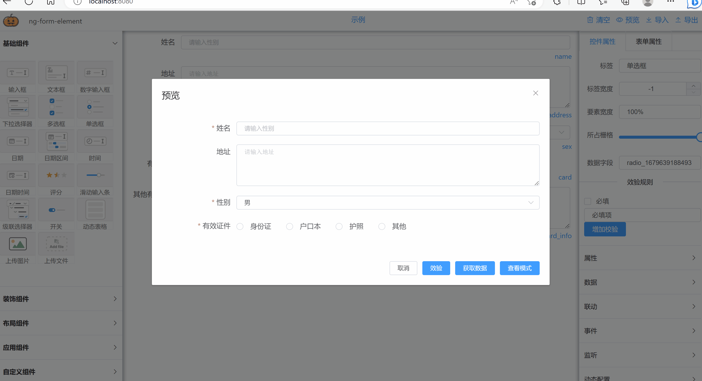

# ng-form 致力打造开源最强vue动态表单组件
NG-FORM-ELEMENT
 
  
 
 **说明**
从2.1.0版本开始支持国际化，内置中文简体和英文两种语言。
 


 **在线示例**
<!--  http://jjxliu306.gitee.io/ng-form-element/ --> 
 https://jjxliu306.github.io/ng-form-element/dist/index.html


 **iview版本地址**
 https://gitee.com/jjxliu306/ng-form-iview

  **element-plus版本（VUE3版本）地址**
 https://gitee.com/jjxliu306/ng-form-elementplus

 
## 后端服务
**ngtool 后端解析和校验功能** 
https://gitee.com/jjxliu306/ngtool

## 文档（陆续更新） 
http://www.ng-form.cn

 
## 集成示例
**基于springboot + vue 的前后端分离集成案例**

后端springboot: https://gitee.com/jjxliu306/ng-server

前端vue: https://gitee.com/jjxliu306/ng-ui
 
## 示例

 **基础表单** 
   


 **表单验证和组件动态显示** 



 **动态表格** 


## 简介

基于vue和element-ui实现的表单设计器。通过拖拽方式快速生成一个表单页面，表单可以导出json格式,也可以将其他人绘制的表单通过json导入方式进行还原。

## 和其他开源表单的差异
 
- 每个组件可以动态隐藏和显示，并且提供除了“必填”以外的多种规则验证，支持表达式验证和正则验证
- 隐藏的组件绑定值可以配置不输出，减少输出数据大小
- 针对选择性控件（radio，select，checkbox）提供选择后触发调用，支持表达式。对选择性控件支持数据联动功能，通过此功能可以做多级联动
- 动态表格提供单独的弹框进行填写和编辑
- 布局方式多样化，提供栅格，表格等多种布局方式 
- 支持表单预览模式，表单内容全部非组件化，全部文本显示
- 针对选择性控件（radio，select，checkbox）选择后将对应的label进行单独存储，方便展示

 

## 组件
- ng-form-design 表单设计器（基于可视化操作快速设计出表单页面，生成配置json或页面）
- ng-form-build 表单构建器（根据设计器中获取的配置json数据，快速构建出表单页面，添加readonly属性后展现预览表单）


 <!--
## CDN 直接使用
 
```
  <!DOCTYPE html>
<html>
<head>
<meta charset="utf-8">
<title>vue-drag-formdesign</title> 
  引入样式  
<link rel="stylesheet" href="https://unpkg.com/element-ui/lib/theme-chalk/index.css">
<link rel="stylesheet" href="https://cdn.jsdelivr.net/gh/jjxliu306/vue-form-design@2.0.10/lib/vue-drag-formdesign.css">
  引入组件库  
<script src="https://unpkg.com/vue/dist/vue.js"></script>
<script src="https://unpkg.com/element-ui/lib/index.js"></script>
<script src="https://cdn.jsdelivr.net/gh/jjxliu306/vue-form-design@2.0.10/lib/vue-drag-formdesign.umd.min.js"></script>
</head> 
<body>
<div id="app"> 
  <vue-drag-formdesign ref="formDesign" > 
    <template  slot="formName">
        <span> vue-drag-formdesign 示例 </span>
    </template>
  </vue-drag-formdesign>  
</div> 
<script>
new Vue({
  el: '#app',
  data: { 
  },
  mounted() { 
  },
  methods: {
     
  }
})
</script>
</body>
</html>
```

**详情可参考项目中 form-cdn.html**
 -->
</div>

## 安装
```
npm install --save  ng-form-element

```
## 引用
```
 // 导入组件库
import NgFormElement  from 'ng-form-element'
import 'ng-form-element/lib/ng-form-element.css'
```

## 注册
``` 
// 注册组件库
Vue.use(NgFormElement) 

```

### 页面引用
```
<div id="app"> 
    <ng-form-design  />
</div>
```
 
### API 说明
#### 1. 表单绘制组件  ng-form-design 

方法:

| 方法名称 | 参数| 说明 |  
|----|----|---------------|
 initModel | json |  初始化动态表单内容，参数为动态表单json模板
 getModel| N/A|  返回当前正在编辑得动态表单信息

属性: 

| 属性名 | 说明 | 格式| 默认值 | 
|----|--------------|---|---|
| customComponents |   自定义组件的配置,具体参加最下方自定义组件示例中的格式 | array | N/A  | 
| config|表单的一些基础配置，主要为http的一些参数,譬如在http请求中给header增加参数：config: { httpConfig: (config)=>{          config.headers['aaaa'] = 'bbbb'          return config  } }| object |  N/A  |
| clear|  是否显示面板上清除按钮 |boolean | true |
| preview|  是否显示面板上预览按钮 |boolean | true | 
| imp|  是否显示面板上导入按钮 |boolean | true |
| exp|  是否显示面板上导出按钮 |boolean | true |
| basic-item|  基础组件是否要展示或待选组件列表集合 |boolean/Array | true |
| personal-item|  个性化组件是否要展示或待选组件列表集合 |boolean/Array | true |
| layout-item|  布局组件是否要展示或待选组件列表集合 |boolean/Array | true | 
| template| 初始化表单内容，可通过.sync进行双向绑定。该数据为通过getModel所返回的内容。|Object| {list: [],config: {labelPosition: "left",labelWidth: 100, size: 'mini',outputHidden: true ,hideRequiredMark: false ,syncLabelRequired: false,customStyle: ""}}|

插槽:

|  插槽名称 | 说明  |
|-----------|-------------------------|
| drag |  左侧组件面板插槽，可以在组件面板上面填充一个区域展示内容|
| form-name |  当前动态表单名称|
| control-button | 功能区按钮,如果需要自定义功能按钮可以在这里自定义 |
 

 插槽示例:
 ```
  <ng-form-design >
        <template slot="controlButton" >
            <el-button   type="text" size="medium"  @click="initDemo(1)">示例1</el-button>
            <el-button   type="text" size="medium"  @click="initDemo(2)">示例2</el-button>
            <el-button   type="text" size="medium"  @click="initDemo(3)">示例3</el-button>
        </template>
        <template  slot="formName">
            <span> vue-drag-formdesign 示例 </span>
        </template>
    </ng-form-design> 
 ```

#### 2. 表单查看/填报组件  ng-form-build

方法:

|  方法名称 | 参数| 说明  |
|-----------|--------|-------------------------|
| reset | N/A |  重置动态表单内容|
| validate| N/A|  根据设置的规则验证当前表单内容,返回Promise|
| getData | N/A | 表单验证后,获取当前表单数据,返回Promise | 
   

属性: 

| 属性名 | 说明 | 格式| 默认值 | 
|-----------|------------------------------|--------|----------|
| formTemplate | 表单模板 | json | 无 |
| models | 表单填充数据 | json | 无 |
| disabled | 是否禁用 | boolean | false |
| renderPreview | 当前是否为预览模式 | boolean | false |
| config|表单的一些基础配置，主要为http的一些参数,譬如在http请求中给header增加参数：config: {  httpConfig: (config)=>{  config.headers['aaaa'] = 'bbbb' return config   } }| object |  N/A  |
| customComponents |   自定义组件的配置,具体参加最下方自定义组件示例中的格式 | array | N/A  |  
 
 

 使用示例:
 ```
    <template>
      <div id="app"> 
         <ng-form-build  :formTemplate="formTemplate" :models="models"/>
      </div>
    </template>
    <script>
    export default {
      data(){
        return {
          models: {} ,
          formTemplate: {}
        }
      },
      created() {
        this.formTemplate = require('./data/basic.json')
      }
    }
    </script>

 ```


# 3. 自定义组件示例

3.1 自定义一个组件（根据文本中输入的地址展示图片）

```
<template>
  <div> 
    <el-input
      v-if="!preview"
      type="textarea"
      autosize
      placeholder="请输入图片地址"
      v-model="models[record.model]" :disabled="disabled">
    </el-input> 
     <el-image
        :style="record.options.style ? record.options.style : null"
        :src="models[record.model]"
        fit="scale-down"></el-image> 
  </div> 
</template>
<script>
  export default { 
    props: {    
      record: {//组件数据
        type: Object,
        required: true
      }, 
      models: {// 表单数组 
        type: Object,
        required: true
      }, 
      disabled: { // 是否禁用
        type: Boolean,
        default: false
      } , 
      preview: {// 是否当前是预览
        type: Boolean ,
        default: false
      } 
    },
    methods: { 
    }
  }
</script>
```

3.2 定义一个自定义组件的属性配置组件（后面通过插槽挂到表单绘制面板的属性面板中）

```
<template>
  <!-- 自定义组件的属性配置 -->  
  <el-form v-show="selectItem.key" size="mini" :disabled="disabled">
    <!-- TCustom   start-->
      <template v-if="selectItem.type == 'customT'"> 
            <!-- 开关的label -->
          <el-form-item   label="图片样式">
              <el-input type="textarea" placeholder="请输入" v-model="selectItem.options.style" /> 
          </el-form-item>
      </template> 
      <!-- TCustom  end -->
  </el-form> 
</template>
<script>
export default {
  props: {
      selectItem: { // 当前选择的组件
        type: Object,
        required: true
      },
      disabled: { // 是否禁用
        type: Boolean,
        default: false
      }
  } 
}
</script>
```

3.3 全局挂载动态表单自定义组件

main.js

```
import CustomIndex from './custom.vue'
import CustomProperties from './properties.vue'
import icon from './icon.js' 

const customComponents = [
  {
    type: 'custom',
    label: '自定义组件1',
    component: CustomIndex ,
    properties: CustomProperties,
    icon: icon
  }
]
 
// 挂载动态表单组件
import FormDesign from 'ng-form-element' 
Vue.use(FormDesign , {components: customComponents})
 
 
```

# 交流
点击链接加入qq群聊，可以直接提问及反馈bug 【交流群：203205848】 <a target="_blank" href="https://qm.qq.com/cgi-bin/qm/qr?k=vNN2AMPxXjojpwYu66DOGNtL2dFYh6Q-&jump_from=webapi"></a>
